# Visualizing

#### goal of visualizing using python

- to understand the data
- to communicate the data

#### libraries

- matplotlib
- seaborn
- plotly
- bokeh

in this course we will focus on `matplotlib` and `seaborn`, you may are interested in others such as `plotly` and `bokeh` for interactive visualizations.

#### matplotlib

- the most popular plotting library in python
- designed to have a similar feel to MATLAB's graphical plotting
- works well with numpy and pandas

#### seaborn

- based on matplotlib
- provides a high-level interface for drawing attractive statistical graphics

#### installing libraries

```python
pip install matplotlib
pip install seaborn
```

after installation you need to import them into your code, for example:

```python
import matplotlib.pyplot
import seaborn
```

one big advantage of using packages in python is to giving them an aliance name, for example:

```python
import matplotlib.pyplot as plt
import seaborn as sns
```
so that they can be called anytime by writing `plt` or `sns` instead of writing the full name.

#### importing datset to work with

data we use here is named 'mpg' which can be downloaded from [here]('data/mpg.csv').

the easiest way to import data is to use pandas library:

```python
import pandas as pd
mpg = pd.read_csv('data/mpg.csv')
```

now before starting plotting some data, lets look at the data:
we can take look at data by looking at first 5 rows of it using `head()` method:

    ```python
    mpg.head()
    ```

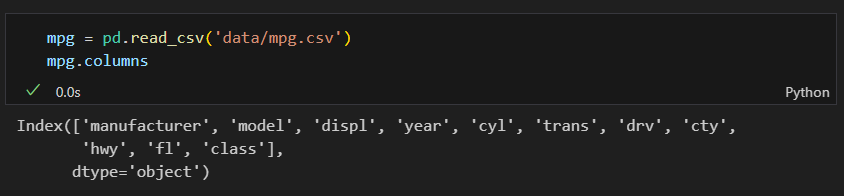

### MetaData of mpg

- `displ` shows the car's engine size in liters
- `hwy` shows the car's fuel efficiency on highways in miles per gallon

### Scatter plot

- a scatter plot is a type of plot that shows the data as a collection of points
- the position of a point depends on its two-dimensional value, where each value is a position on either the horizontal or vertical dimension
- scatter plots are used to observe relationships between variables

#### using matplotlib

```python
plt.scatter(mpg['displ'], mpg['hwy'])
plt.show()
```
or you may use seaborn format of coing:

```python
sns.scatterplot(x='displ', y='hwy', data=mpg)
plt.show()
```
the command `plt.show()` is used to show the plot, without it the plot will not be shown.

by running you can see the plot:

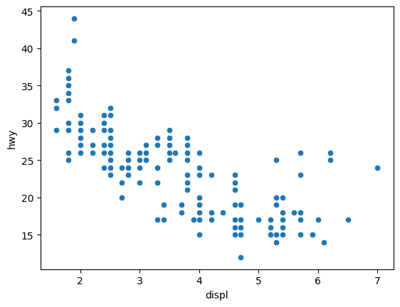

in this format you have option not to choose just a speicif, you can plot all the data in the dataset:

```python
sns.scatterplot(x='hwy', y='cyl', data=mpg)
plt.show()  
```
which will be like this:
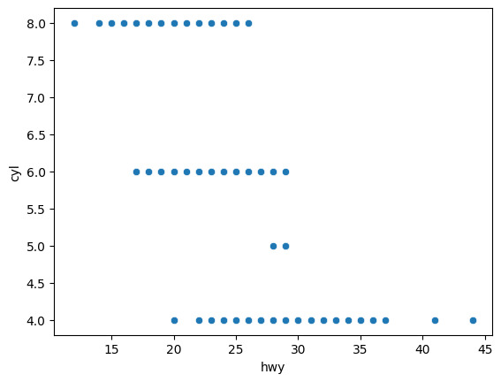

Let’s hypothesize that the cars are hybrids. One way to test this hypothesis is to look at the `hue` value for each car.
`Hue` can be used to group to multiple data variable and show the dependency of the passed data values are to be plotted.

```python
sns.scatterplot(data=mpg, x='displ', y='hwy', hue='class')
plt.show()
```
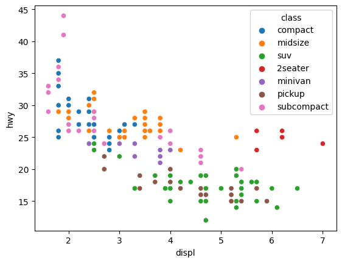

#### using style='class'

style in seaborn Grouping variable that will produce points with different markers. Can have a numeric dtype but will always be treated as categorical.
for example lets plot this  data in mpg based on their car classes

```python
sns.scatterplot(data=mpg, x='displ', y='hwy', style='class')
plt.show()
```


or if you are interested to make it more fancy:

```python
sns.scatterplot(data=mpg, x='displ', y='hwy', style='class', hue='class')
plt.show()
```
this way you can see the difference between the `classes` and based on `hue`


#### what is `hue`

`hue` is a parameter in seaborn scatter plot that is used to Grouping variable that will produce points with different colors. Can be either categorical or numeric, although color mapping will behave differently in latter case.


```python
sns.scatterplot(data=mpg, x='displ', y='hwy', color='blue')
plt.show()
```
This code is used to change the color of dots to blue, you may use other colors as well.

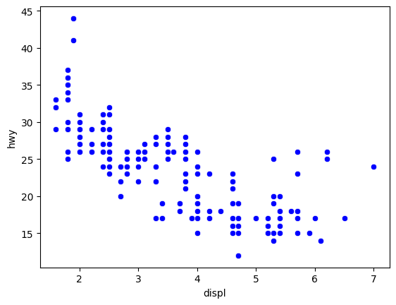

for example lets make them orange

```python
sns.scatterplot(data=mpg, x='displ', y='hwy', color='orange')
plt.show()
```
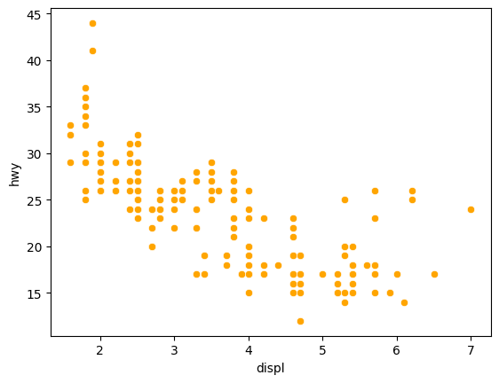

### sns.facetgrid

facetgrid is a Multi-plot grid for plotting conditional relationships. This class maps a dataset onto multiple axes arrayed in a grid of rows and columns that correspond to levels of variables in the dataset. The plots it produces are often called “lattice”, “trellis”, or “small-multiple” graphics.
It can also represent levels of a third variable with the `hue` parameter, which plots different subsets of data in different colors.

```python
g = sns.FacetGrid(data=mpg, col='class', col_wrap=3)
g.map_dataframe(sns.scatterplot, x='displ', y='hwy')
g.add_legend()
plt.show()
```
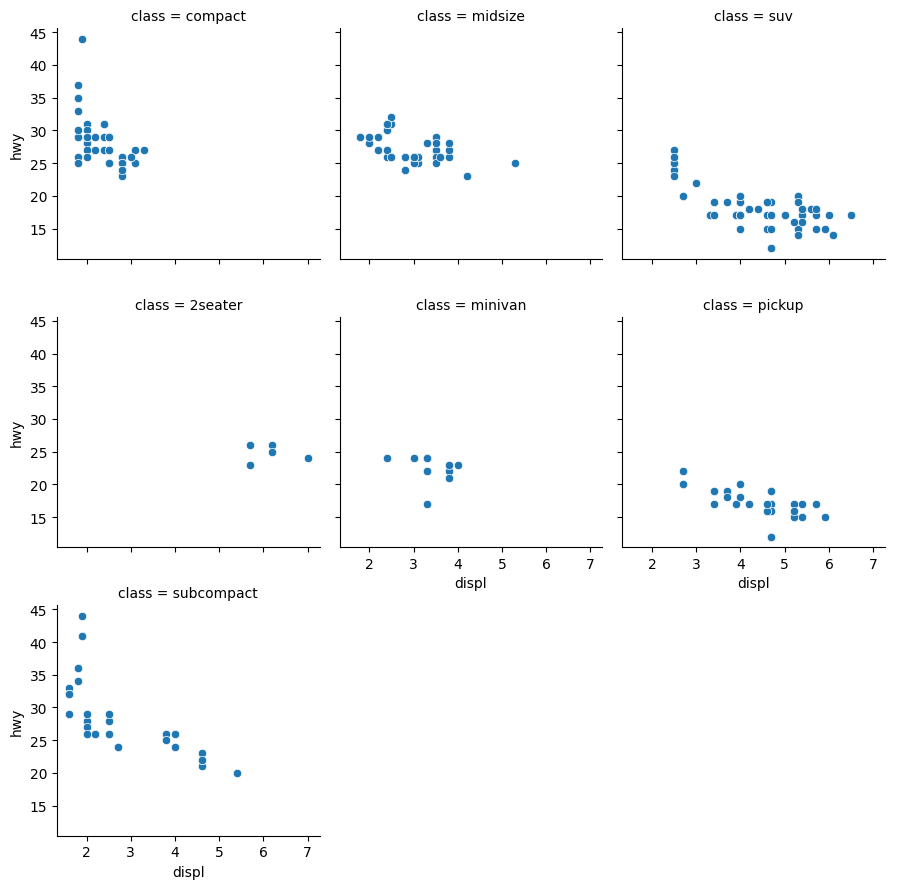

```python
g = sns.FacetGrid(data=mpg, row='drv', col='cyl')
g.map_dataframe(sns.scatterplot, x='displ', y='hwy')
g.add_legend()
plt.show()
```
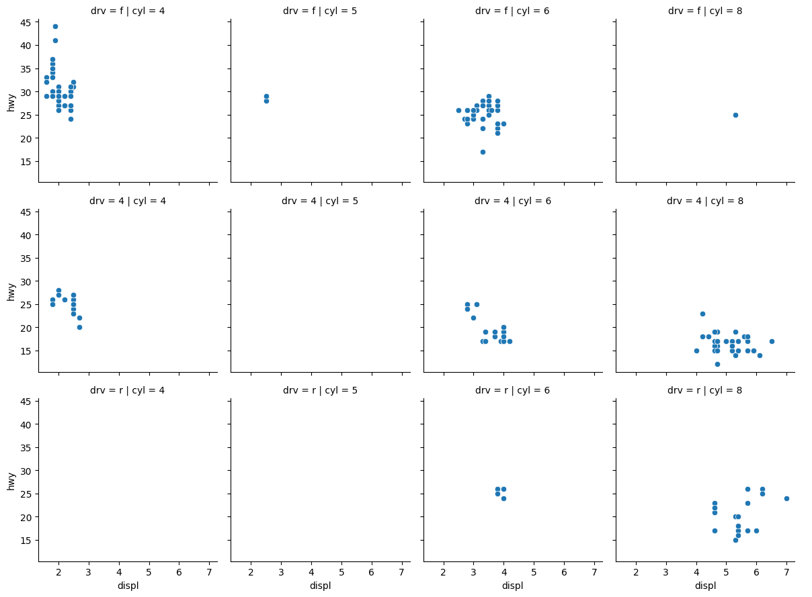

The given code is creating a grid of scatter plots using the seaborn library in Python.

1. `g = sns.FacetGrid(data=mpg, row='drv', col='cyl')`
   - This line initializes a FacetGrid object called 'g'.
   - The `data` parameter specifies the dataset 'mpg' that will be used for plotting.
   - The `row` parameter specifies that the rows of the grid will be determined by the unique values in the 'drv' column of the dataset.
   - The `col` parameter specifies that the columns of the grid will be determined by the unique values in the 'cyl' column of the dataset.

2. `g.map_dataframe(sns.scatterplot, x='displ', y='hwy')`
   - This line maps a scatter plot onto the FacetGrid 'g'.
   - The `sns.scatterplot` function is used to create the scatter plot.
   - The `x` parameter specifies that the 'displ' column will be plotted on the x-axis.
   - The `y` parameter specifies that the 'hwy' column will be plotted on the y-axis.

Overall, this code generates a grid of scatter plots where each subplot represents a different combination of 'drv' and 'cyl' values from the 'mpg' dataset. The scatter plots in each subplot show the relationship between 'displ' (engine displacement) on the x-axis and 'hwy' (highway miles per gallon) on the y-axis for the corresponding 'drv' and 'cyl' values.

## Scatter Plot: drv vs. cyl

```python
sns.scatterplot(data=mpg, x='drv', y='cyl')
plt.show()
```

In this part of the code, a scatter plot is generated using the seaborn library. The function sns.scatterplot creates a scatter plot with 'drv' (drive type) on the x-axis and 'cyl' (number of cylinders) on the y-axis, using the 'mpg' dataset. The plot is displayed using `plt.show()`.

#### Creating a facet grid plot with drv on the rows and cyl on the columns

```python
g = sns.FacetGrid(data=mpg, row='drv', col='cyl')
g.map_dataframe(sns.scatterplot, x='drv', y='cyl')
g.add_legend()
plt.show()
```
 The function `sns.FacetGrid` initializes a grid object `g` with rows determined by the unique values in the 'drv' column and columns determined by the unique values in the 'cyl' column of the 'mpg' dataset. 
 
 The `g.map_dataframe` function is used to map scatter plots onto each cell of the facet grid, with 'drv' on the x-axis and 'cyl' on the y-axis. The `g.add_legend()` function adds a legend to the grid, and the plot is displayed using `plt.show()`.

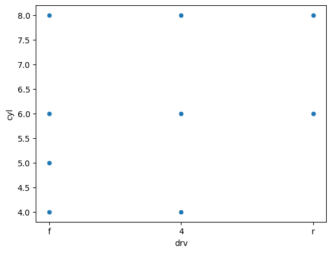
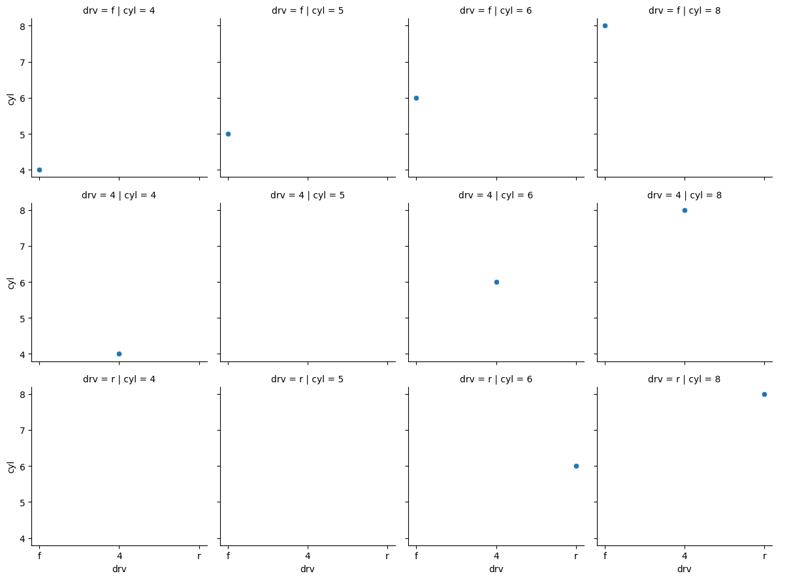

## seaborn.lmplot

`lmplot` is a function in seaborn that is used to draw a scatter plot of two variables with a linear regression line. This function combines `regplot()` and `FacetGrid`. It is intended as a convenient interface to fit regression models across conditional subsets of a dataset.

```python
sns.lmplot(data=mpg, x='displ', y='hwy')
plt.show()
```
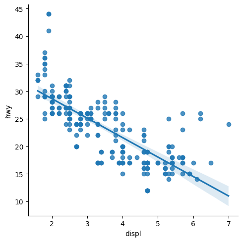

as we already used `hue`. lets try use a different markers for this plot.
    
#### markers 

markers is a parameter in seaborn scatter plot that is used to change the markers for different categorical levels of the hue variable. This parameter is only used if hue is a categorical variable.

markers are usually a list of string or a list of tuples. For example, if the hue variable has three levels, the list of markers should have three elements. If the hue variable has four levels, the list of markers should have four elements, and so on.

```python
sns.lmplot(data=mpg, x='displ', y='hwy', hue='drv', markers=["o", "s", "d"])
plt.show()
```
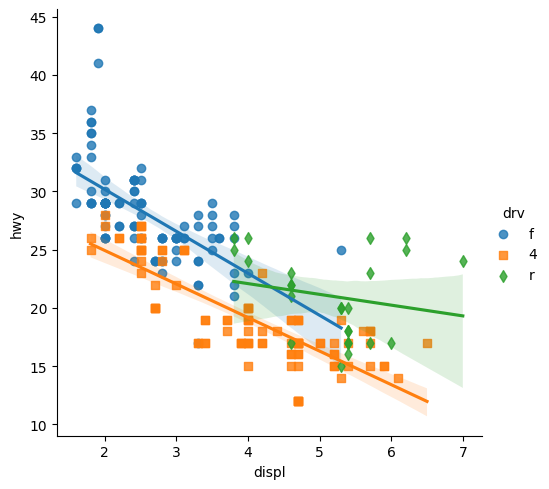

The code snippet `markers=["o", "s", "d"]` is used to customize the marker styles in a scatter plot.

- "o": This marker style represents a circle marker. It's a common marker style for scatter plots and represents individual data points as circular dots.

- "s": This marker style represents a square marker. It's another common marker style used to display data points as square-shaped marks on the plot.

- "d": This marker style represents a diamond marker. It's less common than circles and squares, but it provides a distinctive shape for data points.

These marker styles are often used to differentiate between data points belonging to different categories or groups. By specifying these marker styles, you can create scatter plots with varied visual representations for data points based on their respective categories.

```python
sns.lmplot(data=mpg, x='displ', y='hwy')
plt.show()
```
following code The plot shows a scatter plot of individual data points, and a linear regression line is fitted through the data points to show the general trend.

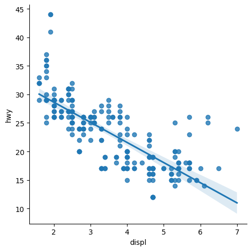

```python

